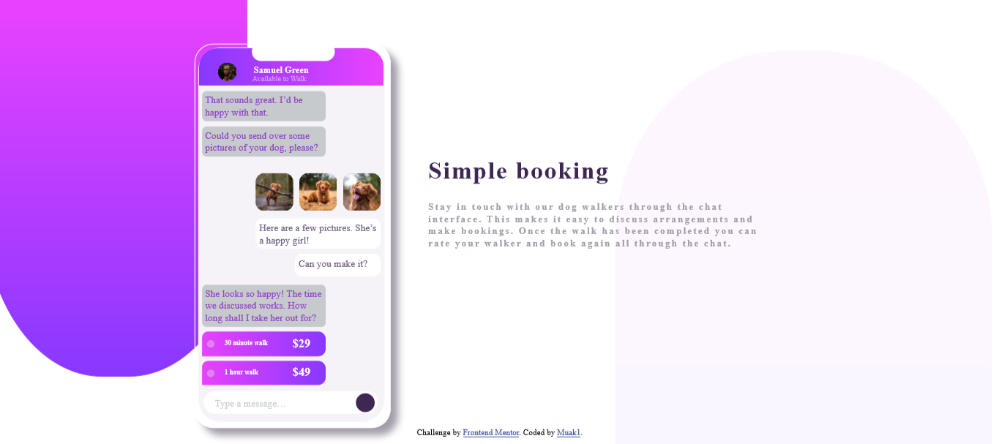
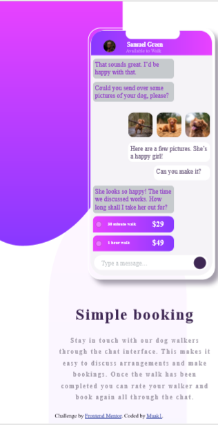

# Frontend Mentor - Chat app CSS illustration solution

This is a solution to the [Chat app CSS illustration challenge on Frontend Mentor](https://www.frontendmentor.io/challenges/chat-app-css-illustration-O5auMkFqY). Frontend Mentor challenges help you improve your coding skills by building realistic projects. 

## Table of contents

- [Overview](#overview)
  - [The challenge](#the-challenge)
  - [Screenshot](#screenshot)
  - [Links](#links)
  - [Built with](#built-with)
  - [What I learned](#what-i-learned)
  - [Continued development](#continued-development)
- [Author](#author)
- [Acknowledgments](#acknowledgments)


## Overview

### The challenge

Users should be able to:

- View the optimal layout for the component depending on their device's screen size
- **Bonus**: See the chat interface animate on the initial load

### Screenshot





### Links

- Solution URL: [Add solution URL here](https://github.com/muakone/chat.git)
- Live Site URL: [Add live site URL here](https://muakone.github.io/chat/)


### Built with

- Semantic HTML5 markup
- CSS custom properties
- Flexbox
- CSS Grid
- Mobile-first workflow


### What I learned
To see how you can add code snippets, see below:

```html
<h1>Some HTML code I'm proud of</h1>
```
```css
#grad1 {
  background-image: linear-gradient(hsl(293, 100%, 63%), hsl(264, 100%, 61%));
}
```

### Continued development

flexbox,grid


## Author

- Website - [Muak 1](https://github.com/muakone/chat.git)
- Frontend Mentor - [@muak](https://www.frontendmentor.io/profile/muak)

## Acknowledgments
i would like to thank w3schools and MDN Web Docs for being so helpful